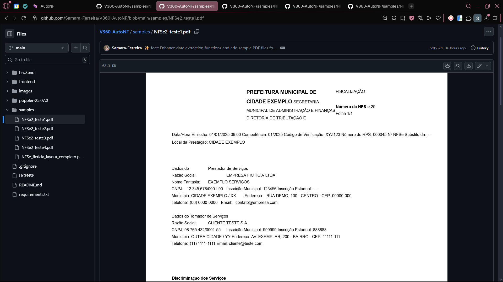
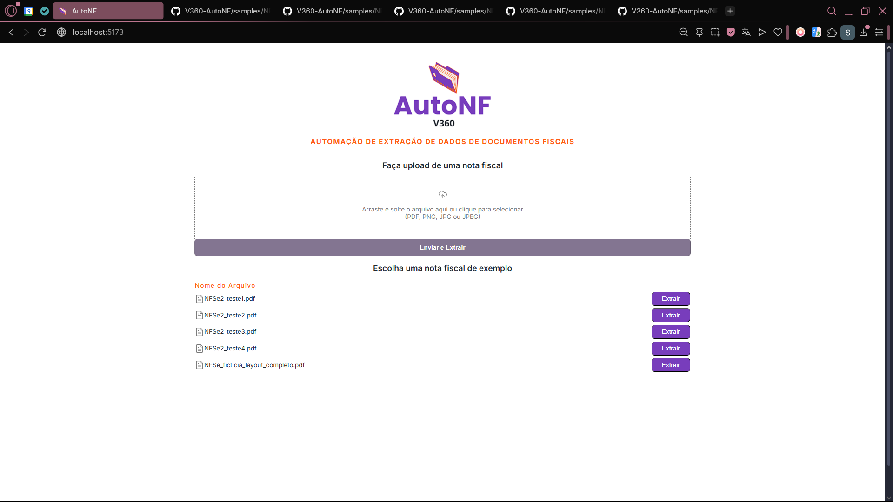
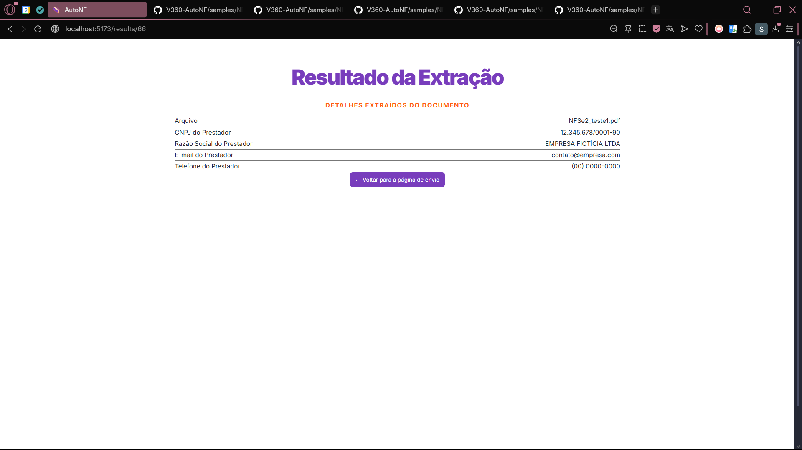

<h1 align="center">
  <br>
     
  <br>
  Automação de Extração de Dados de Notas Fiscais
  <br>
</h1>

<p align="center">
<div align="center">


> Este projeto foi desenvolvido com o objetivo de automatizar o processo manual e repetitivo de extração de dados em notas fiscais. A aplicação consiste em um script para extração de dados com um backend em Python integrado ao frontend de forma interativa em React e Typescript.

## Download do repositório

```
gh repo clone Samara-Ferreira/V360-AutoNF
```
</div>

<div align="justify">

<details open="open">
<summary>Sumário</summary>

- [Sobre o Projeto](#sobre-o-projeto)
    - [Estrutura do Projeto](#estrutura-do-projeto)
    - [Tecnologias Utilizadas](#tecnologias-utilizadas)
- [Como Utilizar](#como-utilizar)
- [Testes](#testes)
</details>

---------------------------

## Sobre o Projeto

O V360-AutoNF é uma aplicação full-stack projetada para automatizar a extração de dados de documentos fiscais (PDFs e imagens). Através de uma interface interativa, o usuário pode fazer o upload de um arquivo ou selecionar um exemplo. O sistema então processa o documento, extrai de forma inteligente o CNPJ, a Razão Social, o e-mail e o telefone do prestador de serviços e exibe o resultado em uma nova página.


### Estrutura do projeto

Segue um mapa simplificado da árvore de diretórios com uma breve explicação de cada parte:

```
V360-AutoNF/
├─ backend/                # API (endpoints, modelos, lógica de extração)
│  ├─ app/                 # App: views, serializers, models e serviços de extração
│  │  ├─ extraction/       # Serviços de extração (OCR, parsing)
│  ├─ manage.py
│  └─ db.sqlite3           # Banco de dados local (dev)
├─ frontend/               # Aplicação React + TypeScript (UI/UX)
│  ├─ src/
│  │  ├─ components/       # Componentes reutilizáveis (dropzone, tabelas, botões)
│  │  ├─ pages/            # Páginas (lista de arquivos, resultados)
│  │  └─ services/         # Cliente API e chamadas HTTP
│  └─ package.json
├─ poppler-*/              # Binários do Poppler (inclusos para Windows)
├─ samples/                # Arquivos de exemplo para testes e demonstração
├─ requirements.txt        # Dependências Python
└─ README.md               # Documentação do projeto
```


### Tecnologias Utilizadas

Nesta seção descrevemos as principais ferramentas e a lógica empregada para extrair informações de PDFs e imagens.

#### Fluxo de Extração de Dados
```
Arquivo (PDF/Imagem)  ──>  [1. Conversão e OCR]  ──>  Texto Bruto  ──>  [2. Parsing Inteligente]  ──>  JSON
```

1. Conversão e Reconhecimento de Texto (OCR)
    - A aplicação primeiro verifica o tipo de arquivo. Se a entrada é um PDF, ela é convertida em uma série de imagens em memória usando `pdf2image`. Se a entrada já é uma Imagem, este passo é pulado;
    - Cada imagem é então processada pelo `pytesseract` para extrair todo o conteúdo textual, resultando em uma única string de texto bruto.

2. Análise e Extração (*Parsing* Inteligente)
    - Isolamento da Seção: O algoritmo analisa o texto bruto em busca de palavras-chave (como "Prestador de Serviços" e "Tomador de Serviços") para "recortar" apenas o bloco de texto que contém os dados do prestador, ignorando o resto do documento. Caso após selecionar os dados ele não encontre o "Tomador de Serviços" para finalizar o recorte, ele pega os 1000 próximos caracteres;
    - Normalização: O bloco de texto isolado passa por um processo de normalização para remover quebras de linha e espaçamentos excessivos, padronizando o texto para a próxima etapa;
    - Extração com Regex: Expressões Regulares (Regex) são aplicadas ao texto normalizado para encontrar e extrair os dados-alvo:
        - CNPJ: Busca pelo padrão exato XX.XXX.XXX/XXXX-XX;
        - Razão Social: Testa uma lista de padrões flexíveis para encontrar o nome da empresa, que pode estar ao lado ou abaixo de diferentes rótulos (ex: "Nome/Razão Social", "Razão Social", "Nome:");
      - E-mail: Procura por padrões comuns de endereços de e-mail (ex: nome@dominio.com) usando uma regex tolerante a espaços e caracteres estranhos introduzidos pelo OCR; aplica normalização para remover pontuações extras e caracteres não imprimíveis;
      - Telefone: Identifica sequências numéricas compatíveis com DDD + número (ex: (11) 99999-9999, 11 9999-9999), permitindo variações com ou sem parênteses, hífens e espaços.

3. Geração da Saída
    - Os dados limpos e extraídos são estruturados em um objeto JSON e retornados pela API, prontos para serem exibidos no frontend.

Abaixo, tem-se uma tabela resumindo cada ferramenta principal e o motivo de sua escolha.

| Ferramenta | Problema que Resolve | Por que foi escolhida? |
| :--- | :--- | :--- |
| **`pdf2image` + `Poppler`** | PDFs podem ser apenas imagens, sem texto selecionável. | Solução padrão e mais confiável no ecossistema Python para converter **qualquer PDF** em imagem, um pré-requisito para o OCR. |
| **`pytesseract` + `Tesseract`** | Imagens precisam ter seu texto "lido" e convertido em uma string. | É a engine de OCR de código aberto **mais poderosa e precisa** disponível, ideal para documentos com texto impresso. |
| **Python + `Regex`** | O texto extraído pelo OCR é um bloco único e desestruturado. | Ferramenta ideal para encontrar **padrões específicos** (como o formato de um CNPJ) e extrair informações contextuais de grandes volumes de texto. |

Com relação as tecnologias do Backend e Frontend, temos:

| Categoria | Tecnologias |
| :--- | :--- |
| **Backend** | `Python`, `Django`, `Django REST Framework` |
| **Frontend** | `React`, `TypeScript`, `Vite`, `Axios`, `React Router DOM` |
| **Banco de Dados** | `SQLite 3` (padrão do Django) |


## Como Utilizar

Siga as instruções abaixo para configurar e executar o projeto em seu ambiente de desenvolvimento local.

### Pré-requisitos

Antes de começar, garanta que você tenha as seguintes ferramentas instaladas em sua máquina:

-   [**Git**](https://git-scm.com/downloads/) (para clonar o repositório)
-   [**Python 3.11+**](https://www.python.org/downloads/)
-   [**Node.js v18+**](https://nodejs.org/en/) (que inclui o `npm`)
-   **Tesseract OCR:** O motor de OCR precisa ser instalado no seu sistema operacional. 

### Instalação e Execução

O projeto é dividido em `backend` e `frontend` e precisa ser executado em dois terminais separados.

**1. Clone o Repositório**
```bash
git clone [https://github.com/Samara-Ferreira/V360-AutoNF.git](https://github.com/seu-usuario/V360-AutoNF.git)
cd V360-AutoNF
```

**2. Configure o Backend**
```bash
# Navegue para a pasta do backend
cd backend

# Crie e ative o ambiente virtual
# No Windows (PowerShell):
python -m venv .venv
.\.venv\Scripts\Activate.ps1

# No Linux ou macOS:
# python3 -m venv .venv
# source .venv/bin/activate

# Instale as dependências do Python
pip install -r requirements.txt

# Aplique as migrações do banco de dados
python manage.py migrate
```

**3. Configure o Frontend**
```bash
# A partir da raiz do projeto, navegue para a pasta do frontend
cd ../frontend 
# ou 'cd ../frontend' em outros terminais

# Instale as dependências do Node.js
npm install
```

**4. Execute a Aplicação (2 Terminais)**

Você precisará de dois terminais abertos para rodar o backend e o frontend simultaneamente.

➡️ Terminal 1: Rodar o Backend
```bash
# Navegue para a pasta 'backend' (se não já estiver lá)
# Ative o ambiente virtual (se não já estiver ativo)
# Inicie o projeto
python manage.py runserver
```
> ✅ Seu backend estará rodando em http://127.0.0.1:8000.

➡️ Terminal 2: Rodar o Frontend
```bash
# Navegue para a pasta 'frontend'
# Inicie o servidor Vite
npm run dev
```
> ✅ Sua aplicação estará acessível no navegador em http://localhost:5173

Observação: Os caminhos para os binários do Tesseract e do Poppler estão definidos no arquivo `backend/api_root/settings.py`. O repositório já inclui os binários do Poppler para Windows, mas o caminho do Tesseract pode precisar de ajuste dependendo de onde você o instalou.


## Testes

A seguir, uma demonstração do fluxo de trabalho da aplicação.

### 1. O Desafio: O Documento Fiscal



> A imagem exibe um exemplo de Nota Fiscal de Serviço (NFS-e). O desafio consiste em extrair, de forma automática e precisa, os dados do **"Prestador de Serviços"** (CNPJ, Razão Social, E-mail e Telefone).

### 2. A Solução



> Esta tela apresenta a interface principal da aplicação, desenvolvida com **React e TypeScript**. Oferece duas formas de interação: um componente de **drag-and-drop** para upload de novos arquivos e uma lista de **documentos de exemplo** para serem selecionados e extraídos os dados. Pode se conferir as informações desses documentos navegando para o diretório `samples`.

### 3. O Resultado



> Após o processamento, o usuário é direcionado para a página de resultados. A imagem demonstra o sucesso da extração: o CNPJ, a Razão Social, o e-mail e o telefone do prestador foram corretamente identificados e são exibidos de forma limpa e organizada. 
</div>